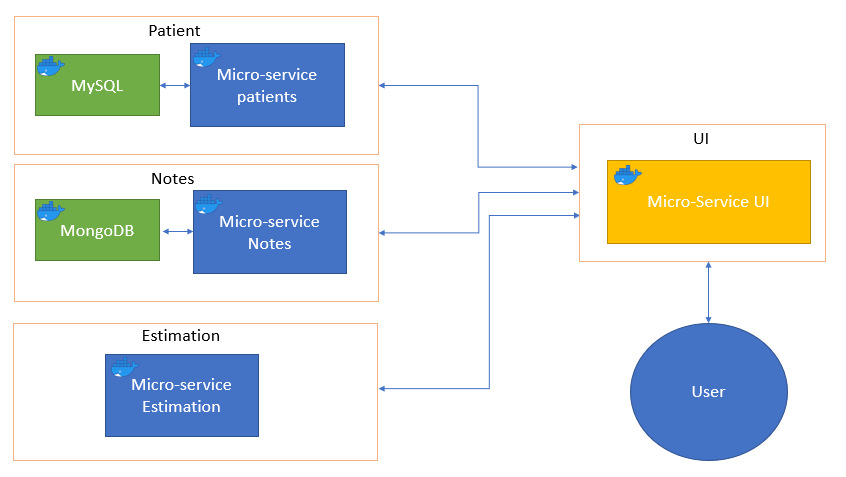

# Mediscreen

## Table of content

* [Technical Informations](#1-technical-informations)
    * [Requirements](#11-requirements)
    * [Setup IntelliJ](#12-setup-with-intellij-ide)
    * [Export Project](#13-export-project)
    * [Docker](#14-docker)
    * [Databases](#15-database)
* [EndPoints](#2-endpoints)
    * [Microservices default urls and ports](#21-microservices-default-url-and-ports)

## 1. Technical informations:

---

### 1.1 Requirements


### 1.2 Setup with Intellij IDE

1. Download project or import it with git.
2. Open project in intelliJ


### 1.3 Export project

Export project with:

```bash
mvn clean install
```

As Tomcat is embbeded, you can launch directly the *.jar with
```bash
java -Duser.language=en -Duser.region=US -jar {nameOfTheFile}.jar
```

### 1.4 Docker

1. Build each image using the DockerFile included in each micro-service folder :
If you want to avoid editing the dockerCompose, use those commands, or edit the compose file 
   according the name you gave to the images.
   Don't forget to be in the right folder to launch the command.
```bash
docker build -t mediscreen-patient .
docker build -t mediscreen-note .
docker build -t mediscreen-estimation .
docker build -t mediscreen-ui .
```
2. Launch the DockerCompose at the root of the project. This file inject using environment variable
the jasypt decoder password and the cross origin url.
   It also launch mysql 8 and mongoDb 4.
 ```bash
 docker-compose up
```
or
 ```bash
 docker compose up
```

### 1.5 Database
1. Once you have launched your mysql and mongoDb containers (with the compose file or separately), 
   execute the .sql file provided (two versions with and without data). You can also import the 
   mongoDB json file with notes related to saved patients.

## 2 EndPoints

---
All endpoints are documented with swagger2. You can access it by launching the app and go to 
this kind of url:
```bash
http://localhost:8080/swagger-ui/
```
Just make sure to access the right url and port for the wanted doc.

Application's Ui is reachable at http://localhost/

### 2.1 MicroServices default url and ports
* Patient -> http://localhost:8081
* Note -> http://localhost:8082
* Estimation -> http://localhost:8083
* UI -> http://localhost


